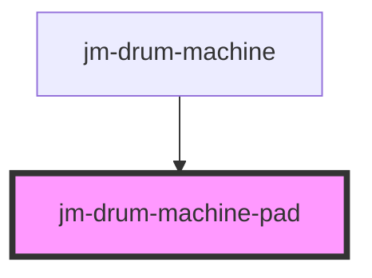

# jm-drum-machine-pad

<!-- Auto Generated Below -->

## Properties

| Property        | Attribute         | Description | Type     | Default     |
| --------------- | ----------------- | ----------- | -------- | ----------- |
| `audioFileName` | `audio-file-name` |             | `string` | `undefined` |

## Events

| Event          | Description | Type                  |
| -------------- | ----------- | --------------------- |
| `jmPadHovered` |             | `CustomEvent<string>` |

## Dependencies

### Used by

 - [jm-drum-machine](../jm-drum-machine)

### Graph

----------------------------------------------

*Built with [StencilJS](https://stenciljs.com/)*
